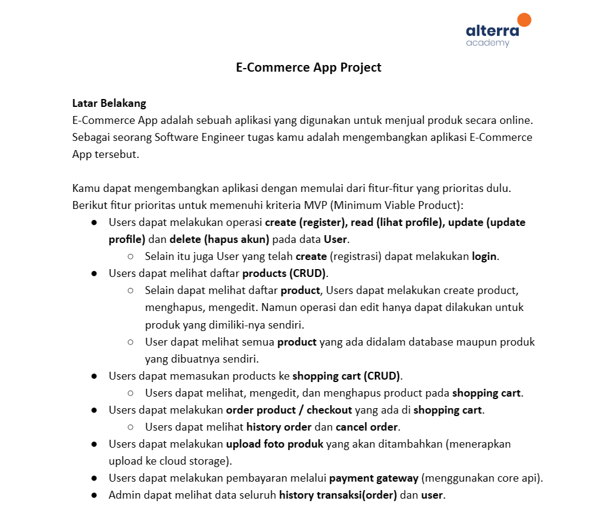
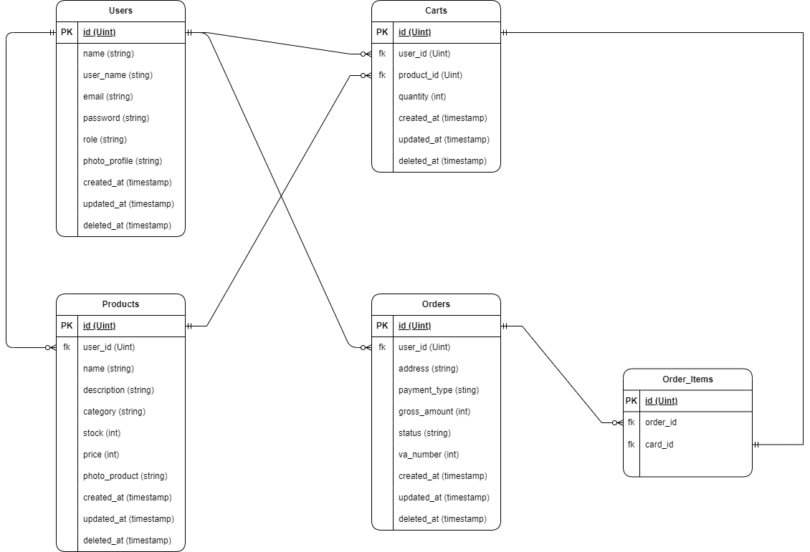
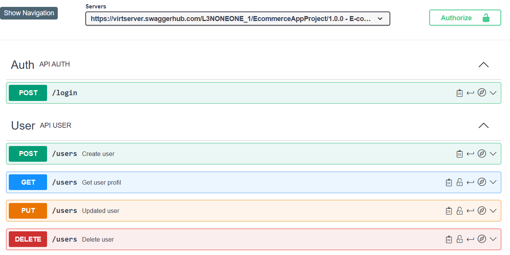
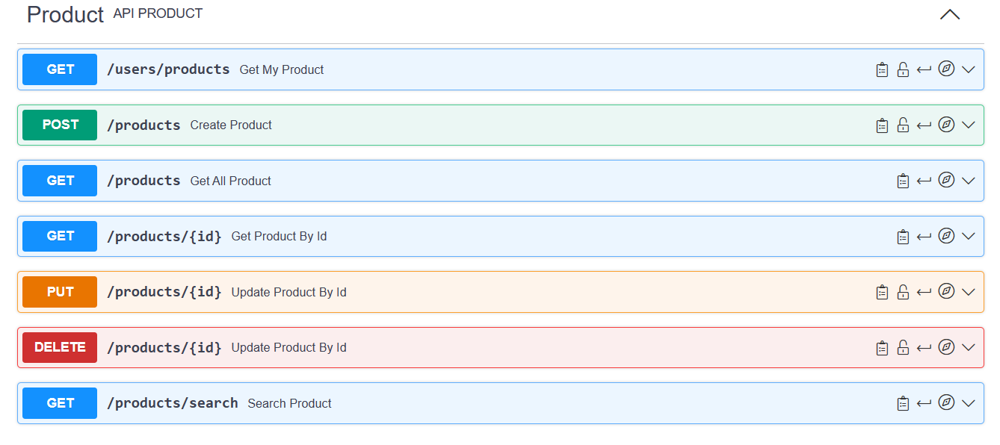
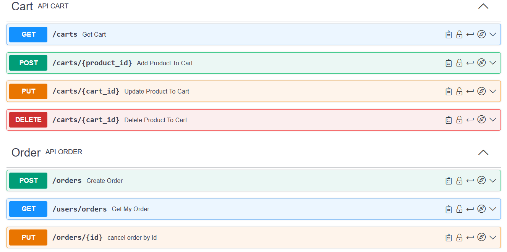
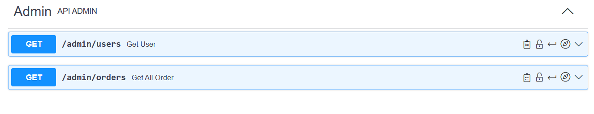
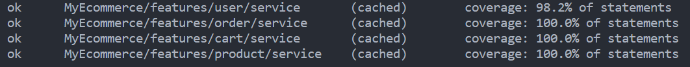

# E-Commerce Apps 'REDSTORE' (Golang)

## Tentang Aplikasi
Aplikasi E-Commerce REDSTORE ini dirancang untuk memudahkan transaksi jual beli produk secara online. Dibangun dengan menggunakan bahasa pemrograman Golang, aplikasi ini menawarkan performa yang cepat dan stabil.

### Fitur Utama
- Autentikasi dan Manajemen User
    - Registrasi User
    - Login User
    - Mendapatkan Detail User
    - Memperbarui Detail User
    - Menghapus User
- Manajemen Produk
    - Membuat Produk Baru
    - Mendapatkan Semua Produk
    - Mendapatkan Detail Produk
    - Memperbarui Produk
    - Menghapus Produk
    - Mendapatkan Produk Berdasarkan User
    - Mencari Produk
- Keranjang Belanja
    - Menambahkan Produk ke Keranjang
    - Menambah Quantity Produk di Keranjang
    - Menghapus Produk dari Keranjang
    - Mendapatkan Produk di Keranjang
- Proses Checkout dan Pembayaran
    - Membuat Order
    - Membatalkan Order
    - Mendapatkan Order User
- Payment Gateway
    - Membuat Pembayaran Order Baru
    - Membatalkan Pembayaran Order
    - Menerima Notifikasi Pembayaran
- Fitur Admin
    - Mendapatkan Semua User
    - Mendapatkan Semua Order

# ERD


## List Endpoint

| Tag | Endpoint |
| --- | --- |
| Auth | `POST /login` |
| User | `POST /users` |
| User | `GET /users` |
| User | `PUT /users` |
| User | `DELETE /users` |
| Product | `POST /products` |
| Product | `GET /products` |
| Product | `GET /products/:id` |
| Product | `PUT /products/:id` |
| Product | `DELETE /products/:id` |
| Product | `GET /users/products` |
| Product | `GET /products/search` |
| Cart | `POST /carts/:product_id` |
| Cart | `PUT /carts/:cart_id` |
| Cart | `DELETE /carts/:cart_id` |
| Cart | `GET /carts` |
| Order | `POST /orders` |
| Order | `GET /users/orders` |
| Order | `PUT /orders/:id` |
| Order | `POST /payment/notification` |
| Admin | `GET /admin/users` |
| Admin | `GET /admin/orders` |

## Swagger Documentation
[>>> Swagger Documentation <<<](https://app.swaggerhub.com/apis-docs/L3NONEONE_1/EcommerceAppProject/1.0.0)

# USERS OPENAPI


# PRODUCTS OPENAPI


# CARTS, ORDERS, OPENAPI


# ADMIN OPENAPI


# TESTING COVERAGE



## Kontributor
- **Lendra Syaputra** - BE 20 ALTA
  - [Github](https://github.com/lendral3n)
- **Muhammad Mahiva Bentar Raharja** - BE 20 ALTA
  - [Github](https://github.com/bentarraharja)


## Cara Menjalankan Aplikasi

### Prasyarat
Sebelum menjalankan aplikasi, pastikan kamu telah menginstal:
- **Cloudinary Account**
- **Midtrans Account**
- **Go versi terbaru**
- **Database MySQL**

### Instalasi
1. Klon repositori ini menggunakan Git:
   ```bash
   git clone https://github.com/Kelompok-2-Project/BACK-END.git

2. Masuk ke direktori aplikasi:
    ```
    cd BACK-END

3. Instal dependensi yang diperlukan:
    ```
    go mod tidy

### Menjalankan Server
- Untuk menjalankan server, gunakan perintah:
    ```
    go run main.go
- Server akan berjalan di 'http://localhost:8000' atau port yang telah kamu tentukan.